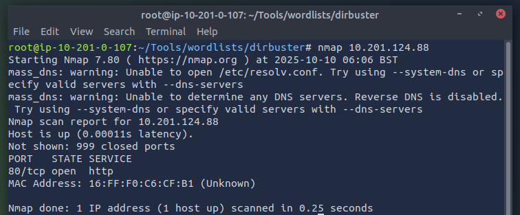
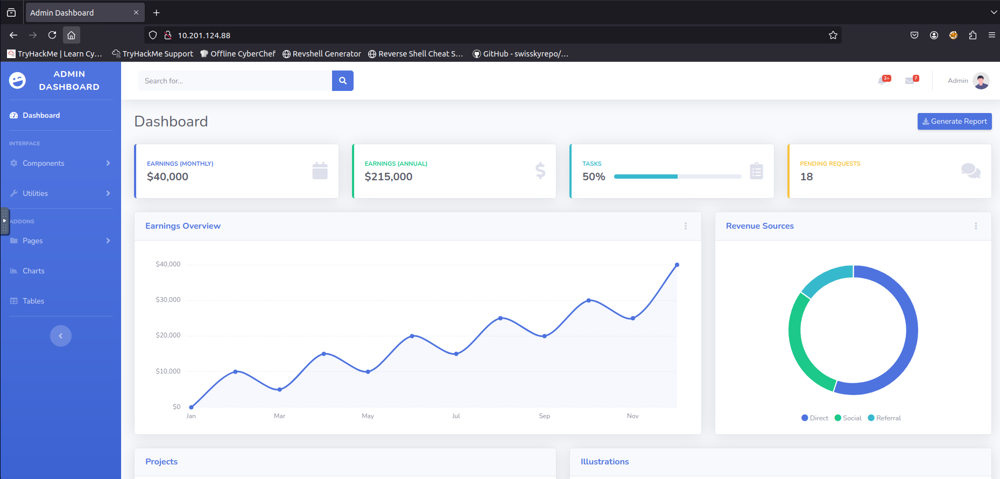
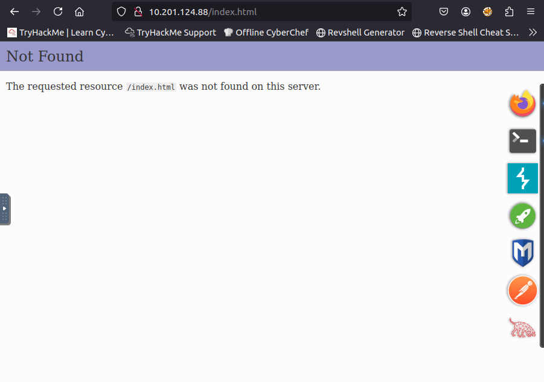
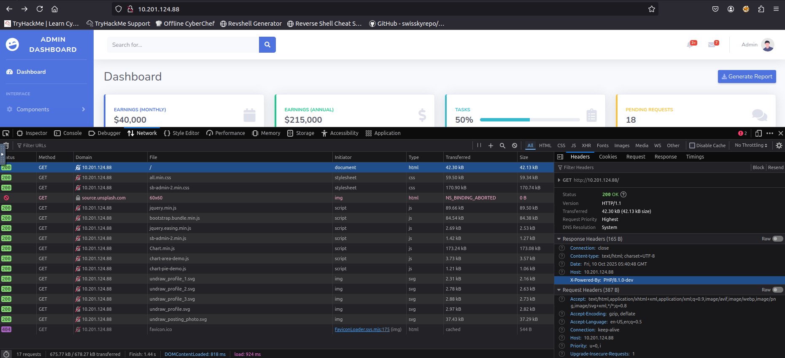
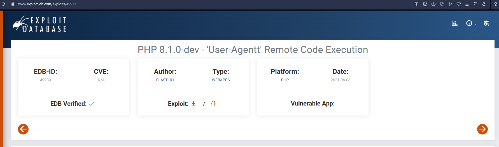
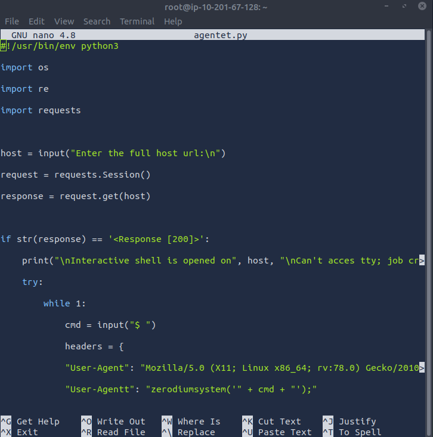
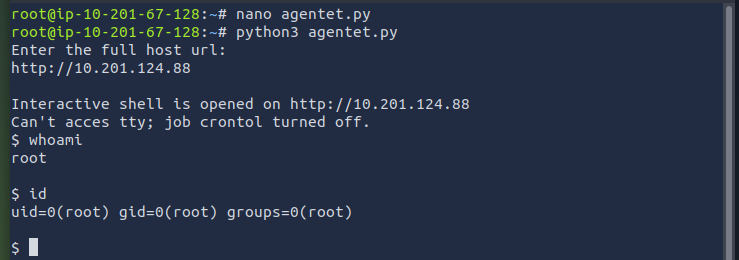
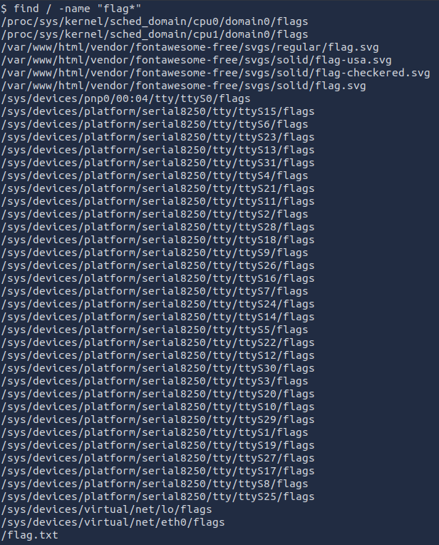
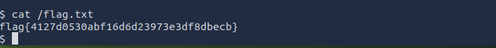

{width="5.905555555555556in"
height="2.3361111111111112in"}

Relatório de CTF

Agent T -- TryHackMe

+:-----------------------------------:+:-----------------------------------:+
| **Informações do documento**                                              |
+-------------------------------------+-------------------------------------+
| **Referência**                      | CTF de estudo -- Mitchell Santana   |
|                                     | Miyake                              |
+-------------------------------------+-------------------------------------+
| **N° Revisão**                      | 1                                   |
+-------------------------------------+-------------------------------------+
| **Data de publicação**              | 10/10/2025                          |
+-------------------------------------+-------------------------------------+
| **Link**                            | https://tryhackme.com/room/agentt   |
+-------------------------------------+-------------------------------------+

  ----------------------- ----------------------- -----------------------
  **Redação**             Mitchell Santana Miyake Estudante

  **Revisão**             Nome do revisor         Orientador

  **Aprovação**           Nome do aprovador       Diretor
  ----------------------- ----------------------- -----------------------

+:-----------------------:+:-----------------------:+:---------------------------------------------:+
| **Histórico de revisões**                                                                         |
+-------------------------+-------------------------+-----------------------------------------------+
| **N°**                  | **Entregas**            | **Descrição**                                 |
+-------------------------+-------------------------+-----------------------------------------------+
| **0**                   | 10/10/2025              | Produção                                      |
+-------------------------+-------------------------+-----------------------------------------------+
| **1**                   | DD/MM/AAAA              | Revisão                                       |
+-------------------------+-------------------------+-----------------------------------------------+
| **2**                   | DD/MM/AAAA              | Aprovação                                     |
+-------------------------+-------------------------+-----------------------------------------------+

**Sumário**

[Contextualização [2](#_Toc77936455)](#_Toc77936455)

[Desenvolvimento [3](#_Toc673335303)](#_Toc673335303)

[Task 1: Find the Flag [3](#_Toc933604461)](#_Toc933604461)

[Conclusão [6](#_Toc854997685)](#_Toc854997685)

[Referências [7](#_Toc1591406912)](#_Toc1591406912)

[]{#_Toc77936455 .anchor}C**ontextualização**

O CTF Agent T sugere que há algo errado com o servidor e desafia o
atacante a obter acesso a ele e obter uma flag, por meio de varredura de
portas, análise de requisições web e escalonamento de privilégios.

[]{#_Toc673335303 .anchor}Desenvolvimento

[]{#_Toc933604461 .anchor}Task 1: Find the Flag

Utilizando o nmap é possível observar que o servidor está com a porta 80
aberta, logo aceita requisições HTTP.

{width="5.90625in" height="2.4479166666666665in"}

Logo acessamos a máquina virtual pelo navegador e somos recebidos com um
dashboard de administrador.{width="5.90625in"
height="2.8333333333333335in"}

Ao clicar no ícone do canto esquerdo superior a seguinte tela aparece,
demonstrando que há algum acesso mal configurado ou vulnerabilidade,
visto que o index.html não está acessível.

{width="5.90625in" height="4.15625in"}

Seguindo a dica da AI do TryHackMe de olhar com atenção os headers,
utilizamos as ferramentas de desenvolvedor, que nos possibilitaram
observar que o header da requisição que obtém o html do site apresenta a
seguinte característica "X-Powered-By: PHP/8.1.0-dev".

{width="5.90625in" height="2.6979166666666665in"}

Após uma busca na internet sobre vulnerabilidades desta versão do PHP,
encontrei um exploit, o qual se trata de um código python, como consta
na referência.

{width="5.90625in" height="1.75in"}

{width="5.854166666666667in" height="5.90625in"}

A execução do código e a inserção da url do servidor resultam no
escalonamento de privilégio, como demonstra a execução dos comandos id e
whoami.

{width="5.90625in" height="2.0729166666666665in"}

Após obter privilégios basta achar a flag dentro do servidor com
comandos como o find e abri-la com o cat.

{width="3.6346041119860018in"
height="4.50945428696413in"}

{width="5.90625in"
height="0.5833333333333334in"}

[]{#_Toc854997685 .anchor}Conclusão

Apesar do desafio proposto ser do nível fácil ele me proporcionou um
aprendizado significativo em investigação digital e resolução de
problemas. Ao longo das etapas, foi necessário pesquisar, testar
abordagens e interpretar pistas, o que estimulou o desenvolvimento do
meu pensamento crítico. Dito isso, ele é um ótimo CTF para estimular a
busca ativa de informação e interpretação de informações.

[]{#_Toc1591406912 .anchor}Referências

- <https://www.exploit-db.com/exploits/49933>

- <https://tryhackme.com/echo>

- https://chatgpt.com
