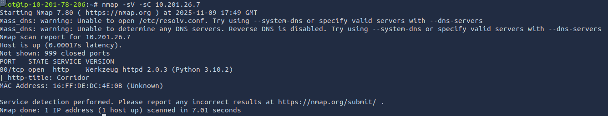
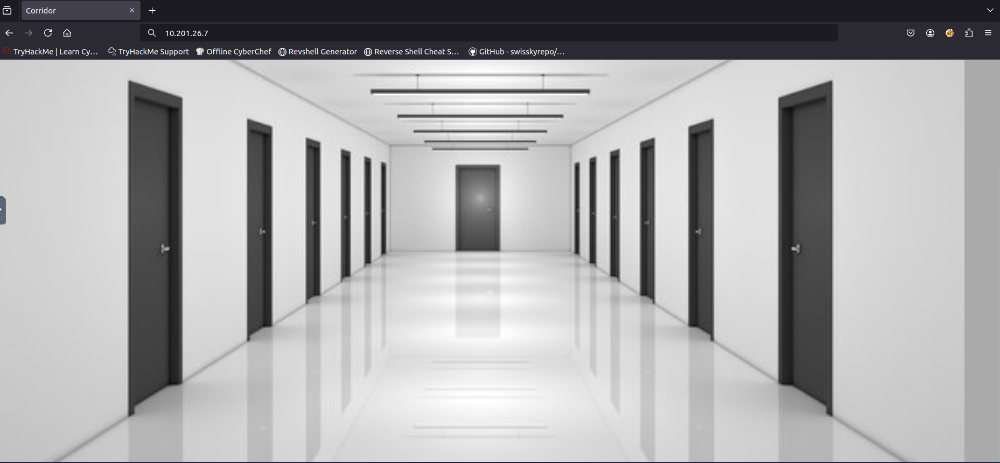
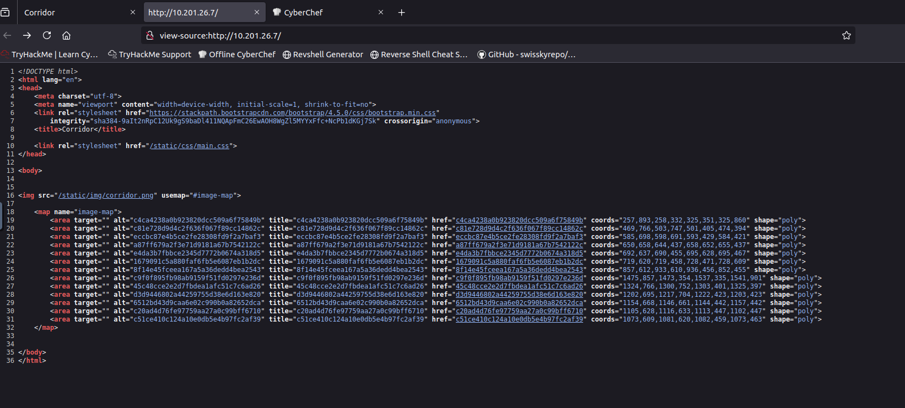
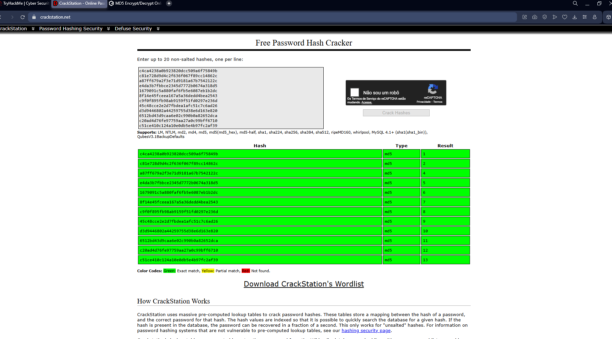
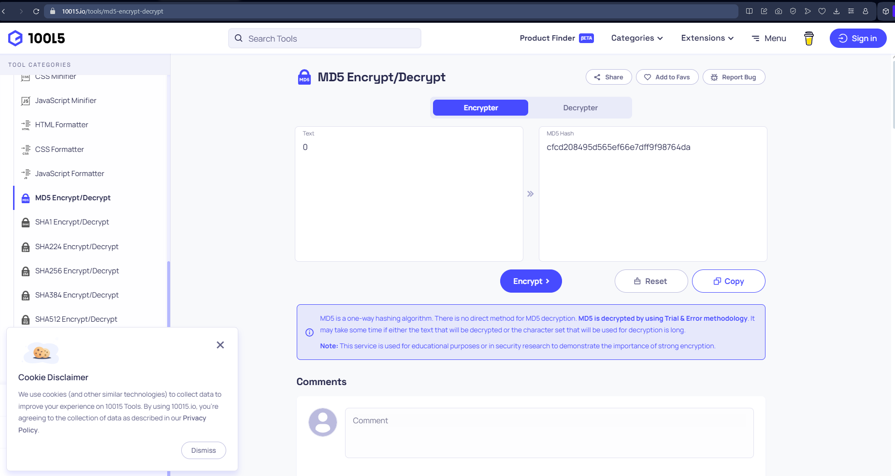
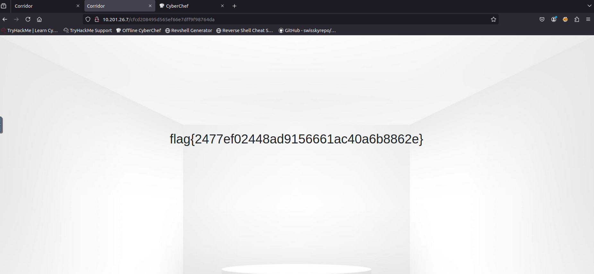

# Relatório de CTF: Corridor -- TryHackMe

## Informações do Documento

| Campo | Detalhe |
| :--- | :--- |
| **Referência** | Corridor -- Mitchell Santana Miyake |
| **N° Revisão** | 1 |
| **Data de publicação** | 09/11/2025 |
| **Link** | https://tryhackme.com/room/corridor |

## Equipe Responsável

| Função | Nome | Cargo |
| :--- | :--- | :--- |
| **Redação** | Nome do realizador | Mitchell Santana Miyake |
| **Revisão** | Nome do revisor | Orientador |
| **Aprovação** | Nome do aprovador | Diretor |

## Histórico de Revisões

| N° | Entregas | Descrição |
| :---: | :--- | :--- |
| **0** | DD/MM/AAAA | Produção |
| **1** | DD/MM/AAAA | Revisão |
| **2** | DD/MM/AAAA | Aprovação |

---

## Sumário
* [Contextualização](#contextualização)
* [Desenvolvimento](#desenvolvimento)
  * [What is the flag?](#what-is-the-flag)
* [Conclusão](#conclusão)
* [Referências](#referências)

---

## Contextualização

O CTF Corridor do TryHackMe é um desafio de nível fácil, focado na exploração de vulnerabilidades de referência a objeto direto insegura ou IDOR. A sala se apresenta como um ambiente onde o jogador se encontra num "corredor estranho" e precisa encontrar o caminho de volta, examinando os endpoints da URL e identificando valores hexadecimais que se assemelham a hashes. O objetivo é manipular esses identificadores para descobrir localizações do website que não deveriam ser acessíveis e, assim, obter a flag.

## Desenvolvimento

### What is the flag?

Primeiramente, utilizamos o nmap para verificar quais portas estão abertas.

A porta 80 está aberta, logo podemos acessar o endereço da máquina pelo navegador.

Somos recebidos por uma imagem de um corredor, com várias portas clicáveis que redirecionam para salas vazias. Verificando o código fonte da página é perceptível que os links de redirecionamento do parâmetro href se assemelham a hashs, como sugerido na instrução do CTF.

Utilizando o CrackStation para verificar o hashs, obtemos que eles se tratam de uma sequência de números de um a treze codificados no hash tipo md5, logo o número zero pode representar um dos outros subdomínios.

Em seguida obtemos o número zero codificado em md5, utilizando o site 10015 tools.

Por fim utilizamos a codificação obtida como parâmetro na url do corredor para obter a flag: **flag{2477ef02448ad9156661ac40a6b8862e}**

## Conclusão

A conclusão do desafio Corridor enfatiza o aprendizado prático de como identificar e explorar falhas de referência a objeto direto insegura. O principal aprendizado reside na importância de nunca confiar na complexidade dos identificadores de recursos como hashes ou valores hexadecimais na URL como uma medida de segurança. O exercício demonstrou que, se um identificador direto não for validado estritamente no lado do servidor para garantir que o utilizador autenticado tem permissão para aceder a esse recurso específico, a vulnerabilidade pode ser explorada através da enumeração ou manipulação desses valores.

## Referências
* https://crackstation.net
* https://10015.io/tools/md5-encrypt-decrypt