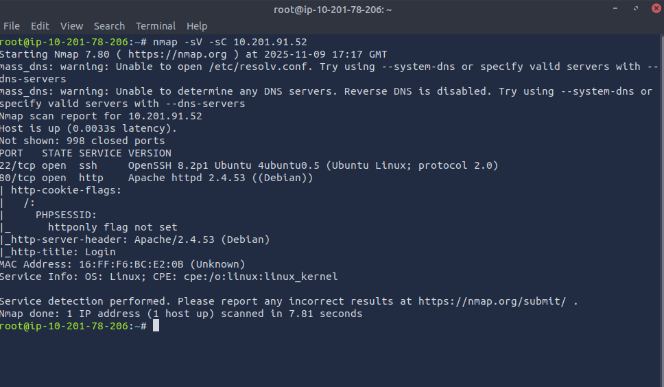
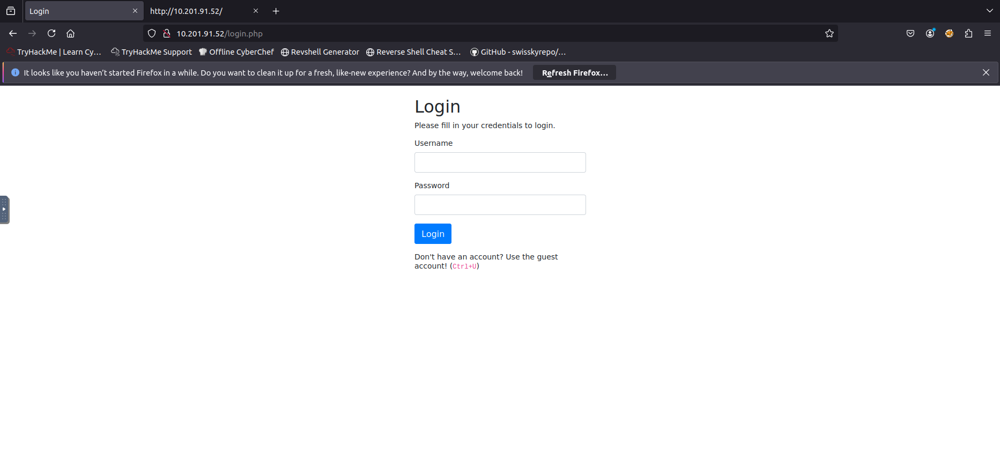
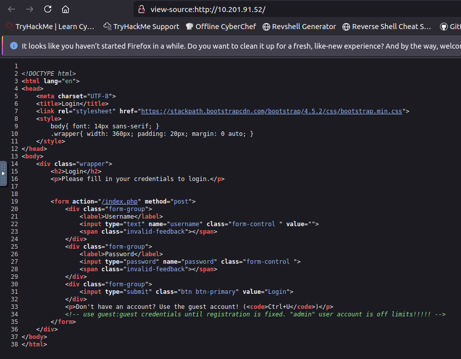
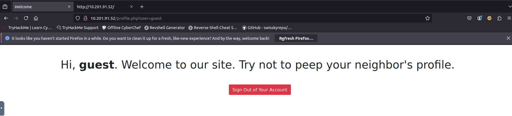
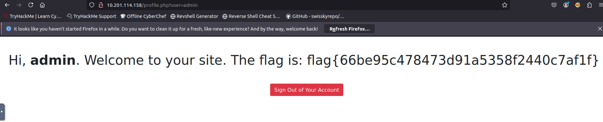

# Relatório de CTF: Neighbour -- TryHackMe

## Informações do Documento

| Campo | Detalhe |
| :--- | :--- |
| **Referência** | Neighbour -- Mitchell Santana Miyake |
| **N° Revisão** | 1 |
| **Data de publicação** | 09/11/2025 |
| **Link** | https://tryhackme.com/room/neighbour |

## Equipe Responsável

| Função | Nome | Cargo |
| :--- | :--- | :--- |
| **Redação** | Nome do realizador | Mitchell Santana Miyake |
| **Revisão** | Nome do revisor | Orientador |
| **Aprovação** | Nome do aprovador | Diretor |

## Histórico de Revisões

| N° | Entregas | Descrição |
| :---: | :--- | :--- |
| **0** | DD/MM/AAAA | Produção |
| **1** | DD/MM/AAAA | Revisão |
| **2** | DD/MM/AAAA | Aprovação |

---

## Sumário
* [Contextualização](#contextualização)
* [Desenvolvimento](#desenvolvimento)
  * [Find the flag on your neighbor's logged in page!](#find-the-flag-on-your-neighbors-logged-in-page)
* [Conclusão](#conclusão)
* [Referências](#referências)

---

## Contextualização

A sala "Neighbour" da TryHackMe é um desafio de nível fácil, focado em atividades de red team em um ambiente Linux. O objetivo é explorar falhas em um novo serviço de nuvem, denominado "Authentication Anywhere", onde o jogador deve tentar encontrar e acessar segredos pertencentes a outros usuários, o que geralmente envolve a exploração de referências de objetos diretos inseguras.

## Desenvolvimento

### Find the flag on your neighbor's logged in page!

Primeiramente, utilizamos o nmap para verificar quais portas estão abertas na máquina alvo.

Verificamos que a porta 80 está aberta, logo podemos acessar o endereço da máquina pelo navegador.

Somos recebidos por uma página de login, a qual sugere que usuários sem conta utilizem a conta de convidado para logar, ao apertar Ctrl+U como sugerido o código fonte da página é exibido, onde se encontra o login de convidado nos comentários do código.

Utilizando as credenciais de convidado guest:guest obtemos acesso à seguinte página.

O parâmetro user se encontra na url da página, previamente foi citado a existência de um usuário admin, logo podemos tentar substituir guest por admin.

Dessa maneira encontramos a flag : **flag{66be95c478473d91a5358f2440c7af1f}**

## Conclusão

O CTF Neighbour proporcionou um aprendizado valioso, especialmente no reconhecimento de falha de controle de acesso a dados e exploração de vulnerabilidades do tipo IDOR. Demonstrou a importância de validar e restringir estritamente as permissões de acesso aos recursos de um usuário, garantindo que ids não possam ser manipulados para acessar informações de terceiros. Além disso, a sala reforçou as habilidades de enumerar serviços e a importância de revisar o código ou o comportamento da aplicação web para identificar padrões de falhas de autenticação e autorização em ambientes Linux e serviços baseados em nuvem.

## Referências