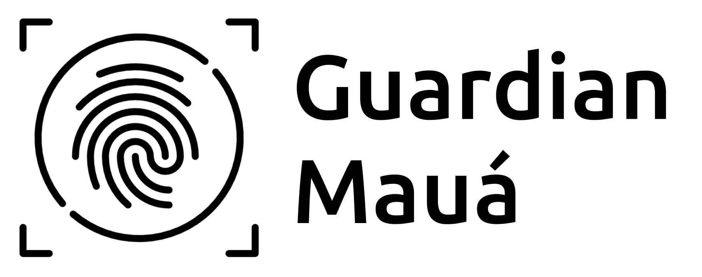

# Relatório de CTF: RootMe -- TryHackMe

## Informações do Documento

| Campo | Detalhe |
| :--- | :--- |
| **Referência** | RootMe -- Mitchell Santana Miyake |
| **N° Revisão** | 1 |
| **Data de publicação** | 13/11/2025 |
| **Link** | https://tryhackme.com/room/rrootme |

## Equipe Responsável

| Função | Nome | Cargo |
| :--- | :--- | :--- |
| **Redação** | Nome do realizador | Mitchell Santana Miyake |
| **Revisão** | Nome do revisor | Orientador |
| **Aprovação** | Nome do aprovador | Diretor |

## Histórico de Revisões

| N° | Entregas | Descrição |
| :---: | :--- | :--- |
| **0** | DD/MM/AAAA | Produção |
| **1** | DD/MM/AAAA | Revisão |
| **2** | DD/MM/AAAA | Aprovação |

---

## Sumário
* [Contextualização](#contextualização)
* [Desenvolvimento](#desenvolvimento)
  * [Scan the machine, how many ports are open?](#scan-the-machine-how-many-ports-are-open)
  * [What version of Apache is running?](#what-version-of-apache-is-running)
  * [What service is running on port 22?](#what-service-is-running-on-port-22)
  * [Find directories on the web server using the GoBuster tool.](#find-directories-on-the-web-server-using-the-gobuster-tool)
  * [Find a form to upload and get a reverse shell and find the flag. Find user.txt](#find-a-form-to-upload-and-get-a-reverse-shell-and-find-the-flag-find-usertxt)
  * [Search for files with SUID permission; which file is weird?](#search-for-files-with-suid-permission-which-file-is-weird)
  * [Find a form to escalate your privileges.](#find-a-form-to-escalate-your-privileges)
  * [Root.txt](#roottxt)
* [Conclusão](#conclusão)
* [Referências](#referências)

---

## Contextualização

O CTF RootMe da TryHackMe é um desafio de nível para iniciantes focado em uma jornada completa de capture the flag em um ambiente Linux. A sala orienta o jogador através das fases essenciais de um teste de penetração: Reconhecimento (varredura de portas com Nmap e enumeração de diretórios com GoBuster), Obtenção de Shell (encontrando e explorando formulários de upload vulneráveis para obter uma reverse shell), e Escalonamento de Privilégios (procurando por arquivos com permissões SUID ou outras falhas de configuração para obter acesso root).

## Desenvolvimento

### Scan the machine, how many ports are open?

Utilizando o nmap podemos escanear quantas portas estão abertas, neste caso duas portas estão abertas.

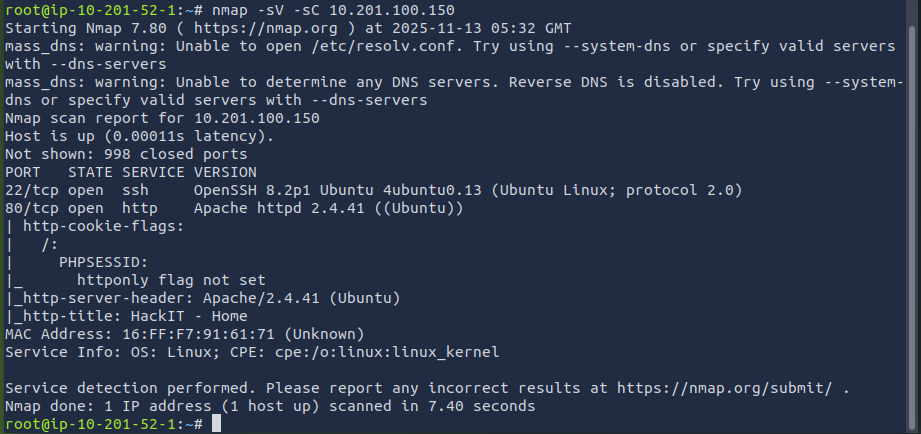

### What version of Apache is running?

Na mesma saída do nmap, encontramos o Apache rodando na versão 2.4.41

### What service is running on port 22?

O serviço SSH está rodando na porta 22.

### Find directories on the web server using the GoBuster tool.

Seguindo a instrução do CTF, utilizamos o GoBuster para verificar os subdiretórios do servidor.

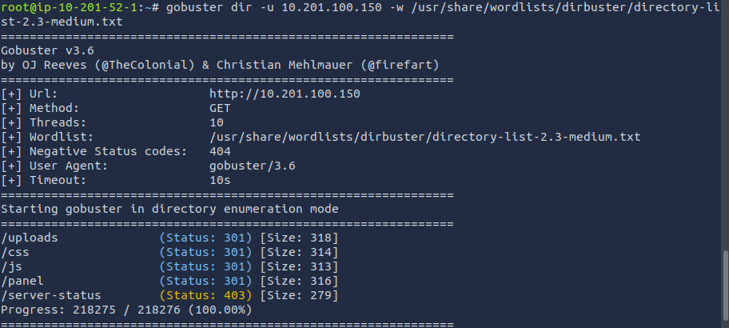

**What is the hidden directory?**

O diretório escondido é /panel.

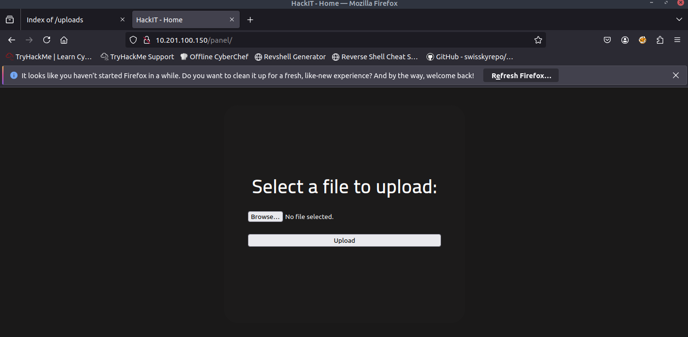

### Find a form to upload and get a reverse shell and find the flag. Find user.txt

Utilizando /panel podemos fazer o upload de arquivos como o user.txt

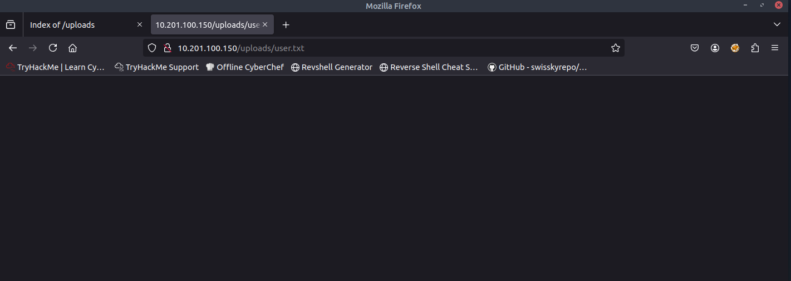

O arquivo user.txt foi enviado com sucesso e está sendo exibido na tela, logo podemos tentar utilizar o seguinte script para obter o reverse shell.

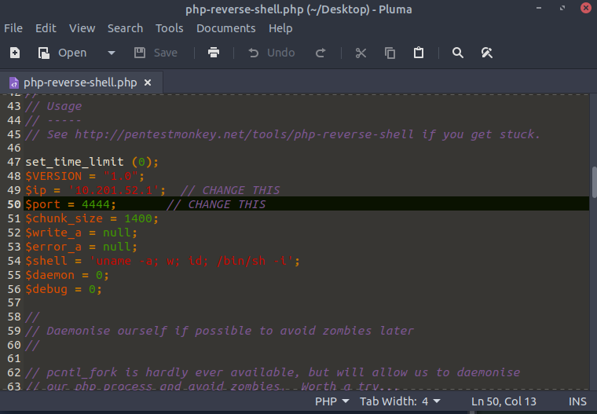

Devemos também configurar o **netcat** para receber a conexão deste reverse shell

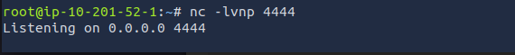

O resultado da tentativa foi o seguinte:

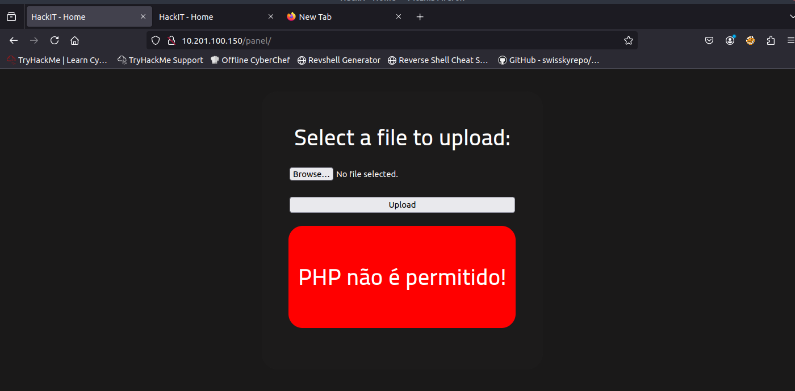

Arquivos no formato .php estão sendo bloqueados, portanto podemos tentar utilizar formatos como .php.jpg ou .php5

Utilizando o formato .php5 no script, obtivemos acesso no **netcat** que havíamos configurado.

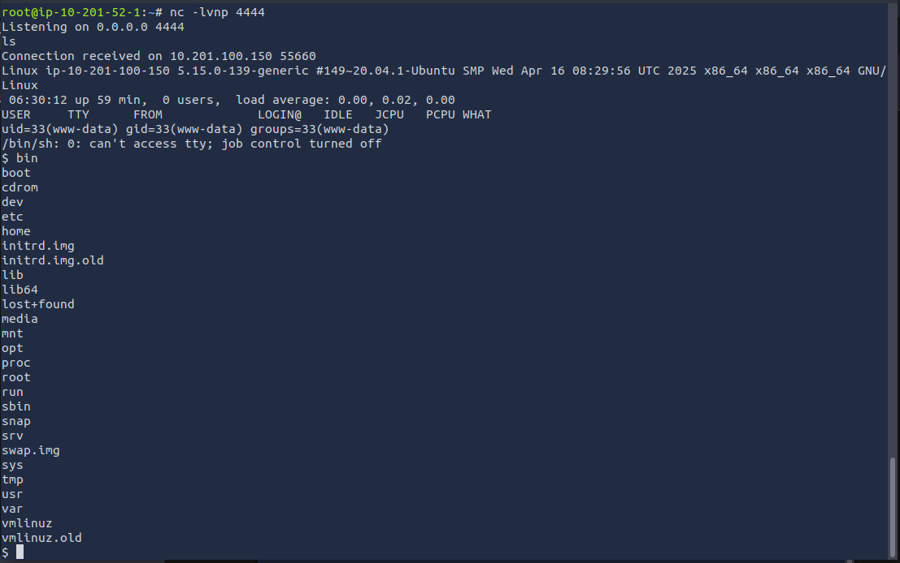

Logo podemos realizar uma busca utilizando o find para encontrar o user.txt

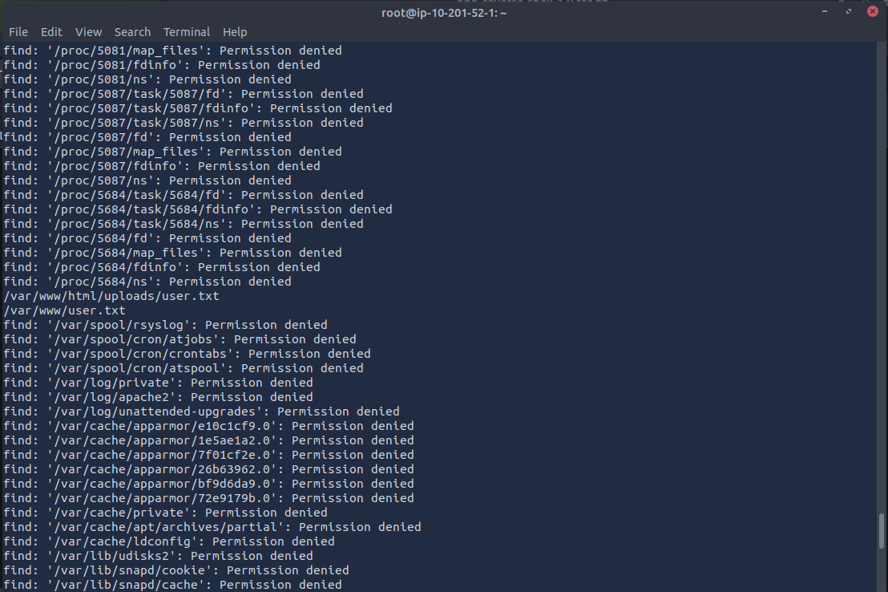

Dessa maneira encontramos o user.txt e sua flag

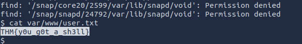

### Search for files with SUID permission; which file is weird?

Para procurar onde o usuário possui permissões SUID utilizamos o comando find / -user root --perm /4000 2>/dev/null

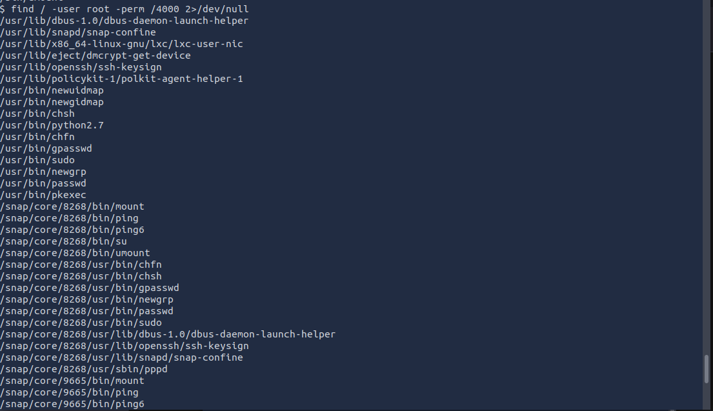

Nesta saída o diretório **/usr/bin/python2.7** parece estar fora de lugar.

### Find a form to escalate your privileges.

Realizando uma busca de como se aproveitar da vulnerabilidade de permissão do diretório **/usr/bin/python2.7** encontramos o seguinte comando **python --c 'import os; os.execl("/bin/sh","sh","-p")'**, após sua utilização podemos rodar o comando whoami para verificar nosso usuário, neste caso obtemos acesso ao usuário root.

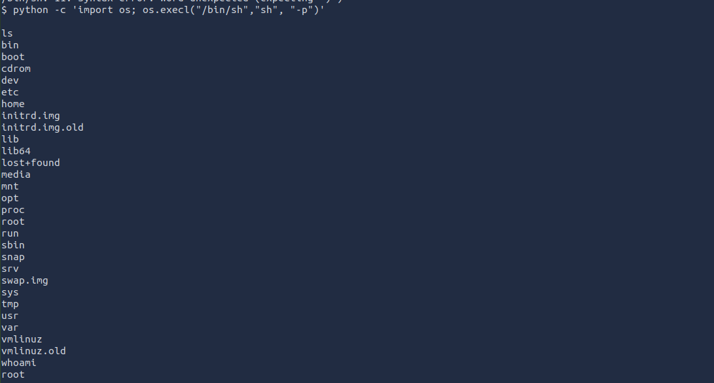

### Root.txt

Por fim, após obter acesso ao usuário root, utilizamos o comando find para encontrar o arquivo root.txt e sua flag

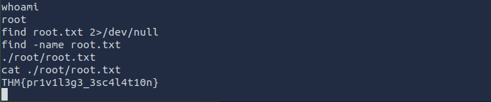

## Conclusão

A conclusão do desafio RootMe está centrada na consolidação de uma metodologia de pentest ponta a ponta. O aprendizado reforçou a importância da enumeração como passo inicial, bem como a exploração de vulnerabilidades de upload de arquivos para obter acesso inicial à máquina. Mais significativamente, o CTF destacou técnicas de escalonamento de privilégios no Linux, ensinando a identificar binários SUID mal configurados e a utilizar recursos do sistema operacional para passar de um usuário comum para o utilizador root, obtendo domínio total do sistema.

## Referências
* https://beginninghacking.net/2020/09/09/try-hack-me-rootme/
* https://pentestmonkey.net/tools/web-shells/php-reverse-shell
* https://gtfobins.github.io/gtfobins/python/