# Relatório de CTF: Simple CTF -- TryHackMe

## Informações do Documento

| Campo | Detalhe |
| :--- | :--- |
| **Referência** | Simple CTF -- Mitchell Santana Miyake |
| **N° Revisão** | 1 |
| **Data de publicação** | 10/10/2025 |
| **Link** | https://tryhackme.com/room/easyctf |

## Equipe Responsável

| Função | Nome | Cargo |
| :--- | :--- | :--- |
| **Redação** | Mitchell Santana Miyake | Estudante |
| **Revisão** | Nome do revisor | Orientador |
| **Aprovação** | Nome do aprovador | Diretor |

## Histórico de Revisões

| N° | Entregas | Descrição |
| :---: | :--- | :--- |
| **0** | 10/10/2025 | Produção |
| **1** | DD/MM/AAAA | Revisão |
| **2** | DD/MM/AAAA | Aprovação |

---

## Sumário
* [Contextualização](#contextualização)
* [Desenvolvimento](#desenvolvimento)
  * [How many services are running under port 1000?](#how-many-services-are-running-under-port-1000)
  * [What is running on the higher port?](#what-is-running-on-the-higher-port)
  * [What's the CVE you're using against the application?](#whats-the-cve-youre-using-against-the-application)
  * [To what kind of vulnerability is the application vulnerable?](#to-what-kind-of-vulnerability-is-the-application-vulnerable)
  * [What's the password?](#whats-the-password)
  * [Where can you login with the details obtained?](#where-can-you-login-with-the-details-obtained)
  * [What's the user flag?](#whats-the-user-flag)
  * [Is there any other user in the home directory? What's its name?](#is-there-any-other-user-in-the-home-directory-whats-its-name)
  * [What can you leverage to spawn a privileged shell?](#what-can-you-leverage-to-spawn-a-privileged-shell)
  * [What's the root flag?](#whats-the-root-flag)
* [Conclusão](#conclusão)
* [Referências](#referências)

---

## Desenvolvimento

### How many services are running under port 1000?

Utilizando o seguinte comando "nmap -A -sV --sC 10.201.20.250 --traceroute", obtemos a seguinte imagem, que nos permite afirmar que existem **dois serviços** rodando neste endereço.

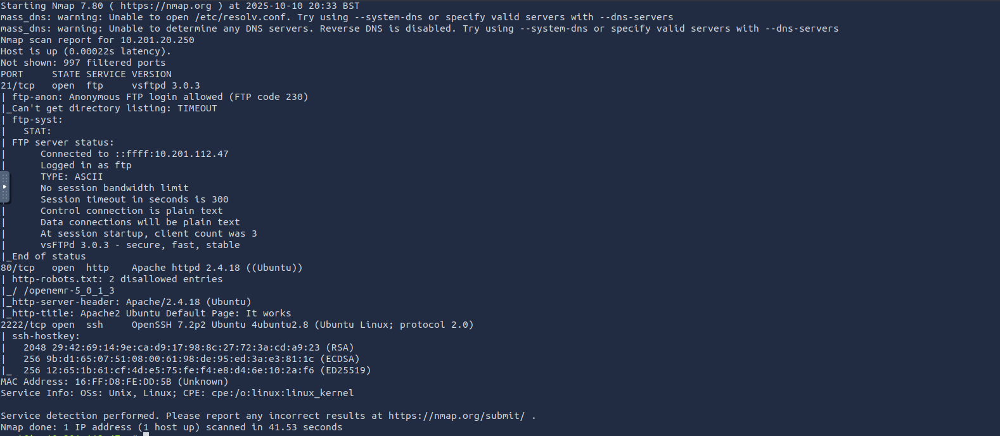

### What is running on the higher port?

Utilizando o resultado do mesmo comando **nmap** podemos notar que a maior porta é a 2222 e nela está configurada o **SSH**.

### What's the CVE you're using against the application?

Aplicamos o **GoBuster** no endereço para descobrir possíveis subdomínios e obtivemos os seguintes resultados.

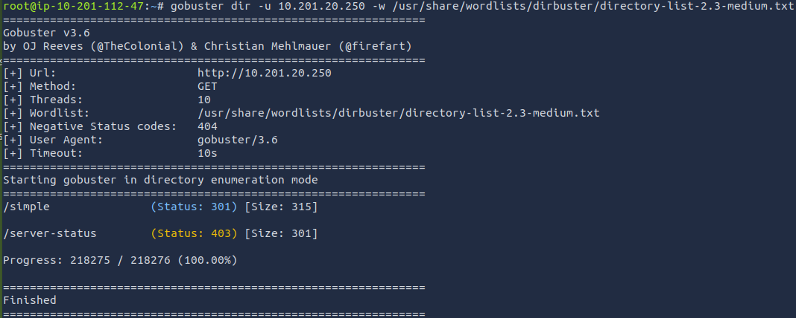

Ao acessar o subdomínio /simple encontramos a seguinte página, nela podemos observar que ela utiliza da versão CMS Made Simple 2.2.8.

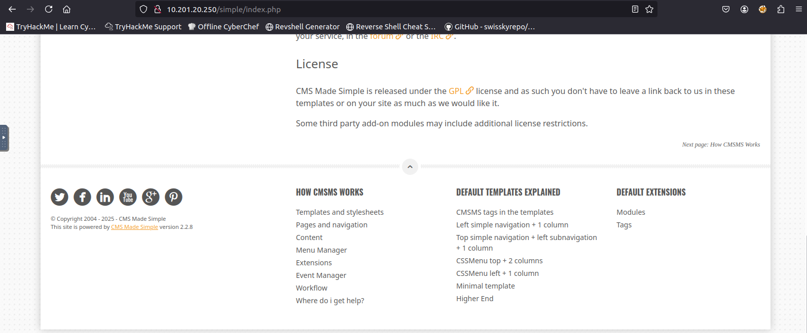

Após uma busca de vulnerabilidades desta versão, encontrei um exploit que realiza uma injeção de sql no servidor.

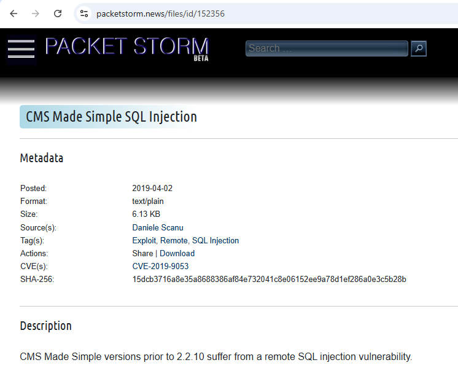

Este exploit se trata de um script python que apresenta a seguinte versão do CVE: **CVE-2019-9053**

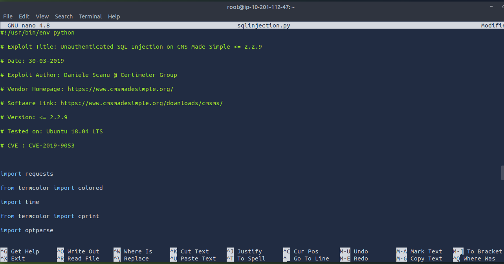

### To what kind of vulnerability is the application vulnerable?

Como descrito no passo anterior a vulnerabilidade se trata de um SQL injection ou **sqli.**

### What's the password?

Utilizamos o seguinte comando para rodar o script.

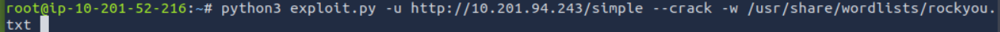

Em sequência obtemos as informações de login de um usuário.

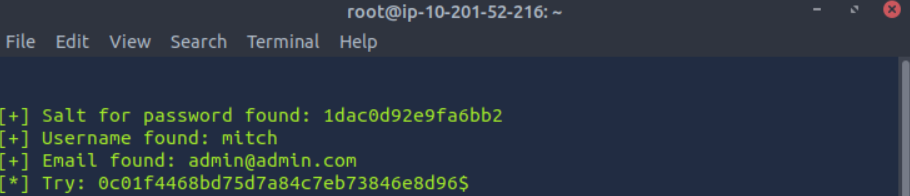

Como a senha não foi disponibilizada utilizaremos a ferramenta **hydra** para encontrá-la.

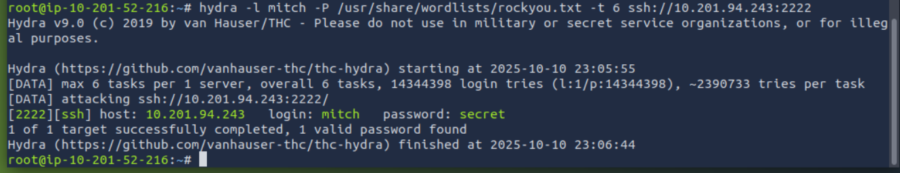

Após sua execução, a senha **secret** é revelada.

### Where can you login with the details obtained?

Agora que possuímos todos os dados de login podemos logar no **ssh** pela porta 2222.

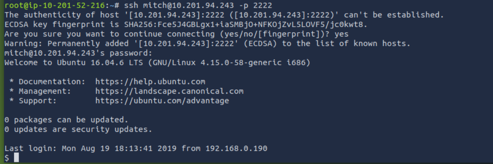

### What's the user flag?

Já logado com a credencial mitch, fiz uma busca simples buscando dentro dos diretórios onde encontrei a seguinte flag: **G00d j0b, keep up!**

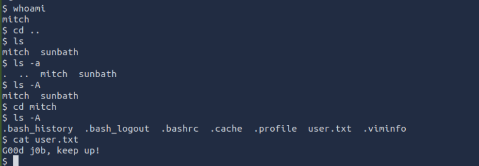

### Is there any other user in the home directory? What's its name?

Após ir até o diretório home descobrimos que o outro usuário é **sunbath**.

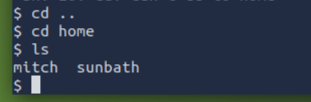

### What can you leverage to spawn a privileged shell?

Utilizando o sudo --l, verificamos se o usuário mitch possui alguma permissão de executar algo com permissões root sem a necessidade de logar no root, logo podemos aproveitar o **vim** para obter uma cli privilegiada.

### What's the root flag?

Utilizando a vulnerabilidade referenciada na última questão, rodamos o comando **sudo vim --c '!sh'** para obter acesso ao usuário root.

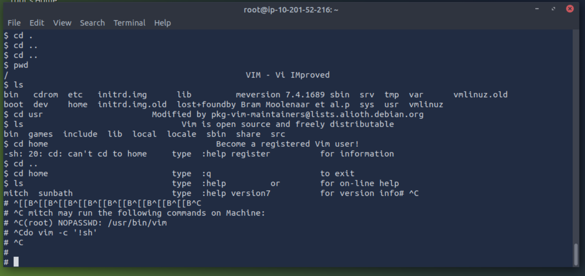

Por fim, navegamos até o usuário root e obtemos a flag: **W3ll d0n3. You made it!**

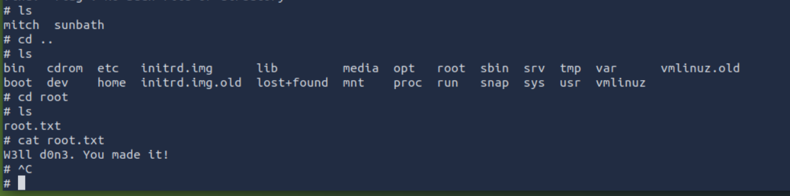

## Conclusão

O *Simple* CTF do TryHackMe trata de enumeração, escalonamento de acesso e exploração de vulnerabilidades. Durante o desafio ele promoveu uso de ferramentas essenciais como nmap, gobuster e scripts de pós-exploração e me estimulou a pensar na lógica por trás das vulnerabilidades. Portanto, ele é um ótimo CTF para adquirir conhecimento sobre ganho de acesso e exploração de vulnerabilidades.

## Referências
* https://www.codecademy.com/resources/docs/cybersecurity/nmap/aggressive-scan
* https://tryhackme.com/echo
* https://github.com/OJ/gobuster
* https://github.com/advisories/GHSA-rrqg-2h39-2567
* https://packetstorm.news/files/id/152356
* https://www.kali.org/tools/hydra/
* https://medium.com/@akerkar34/simple-ctf-tryhackme-walkthrough-13fae8abe32d