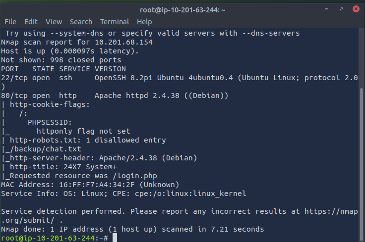
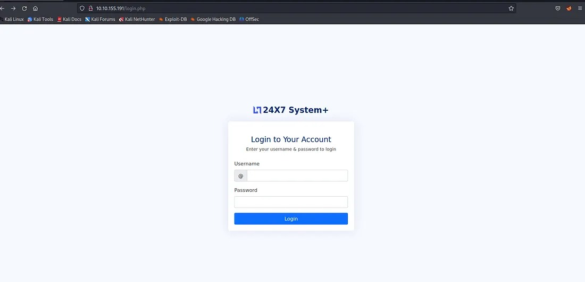
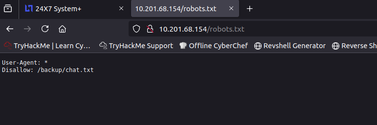
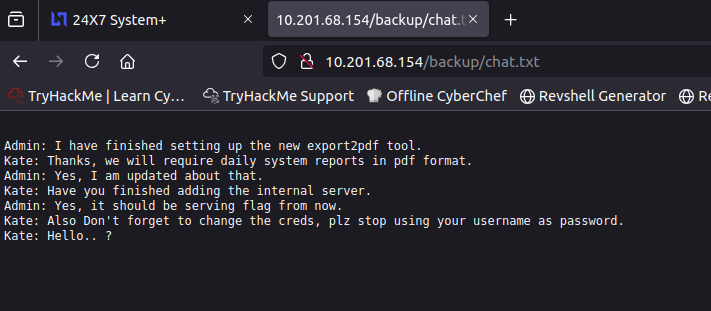
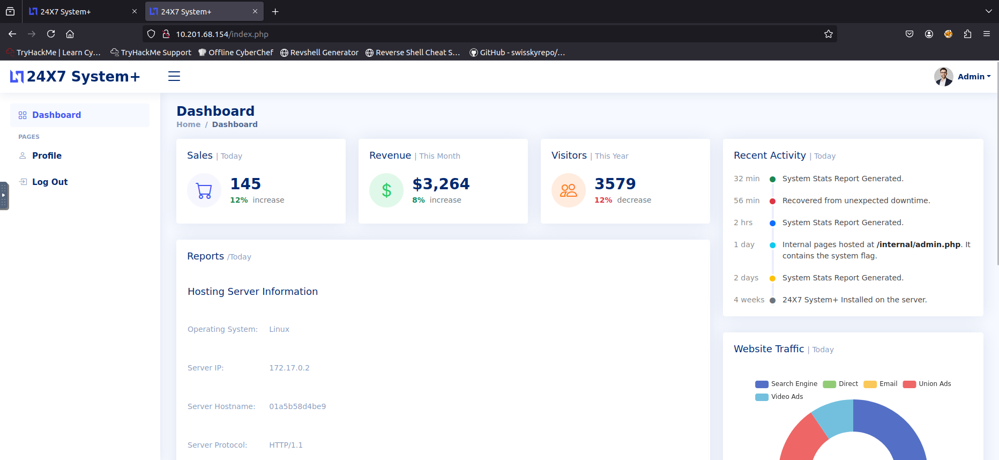
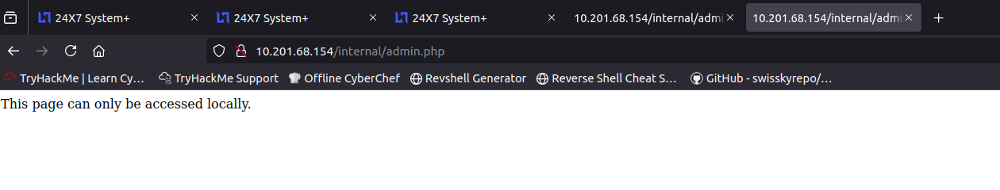
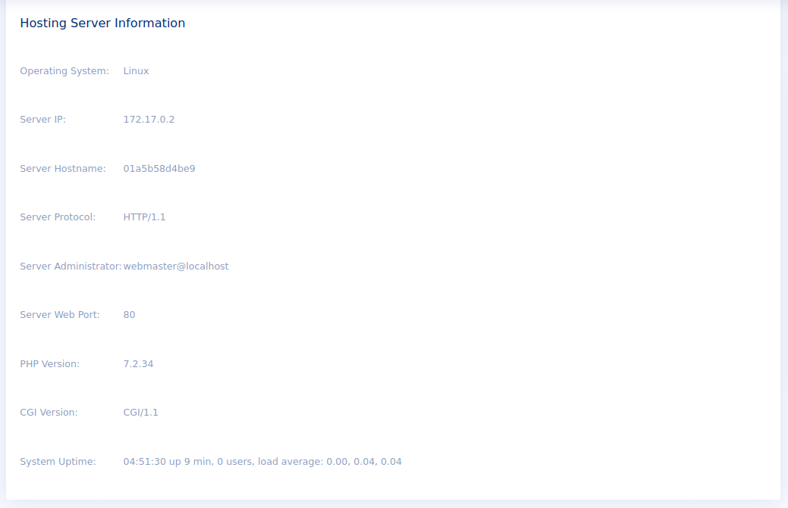
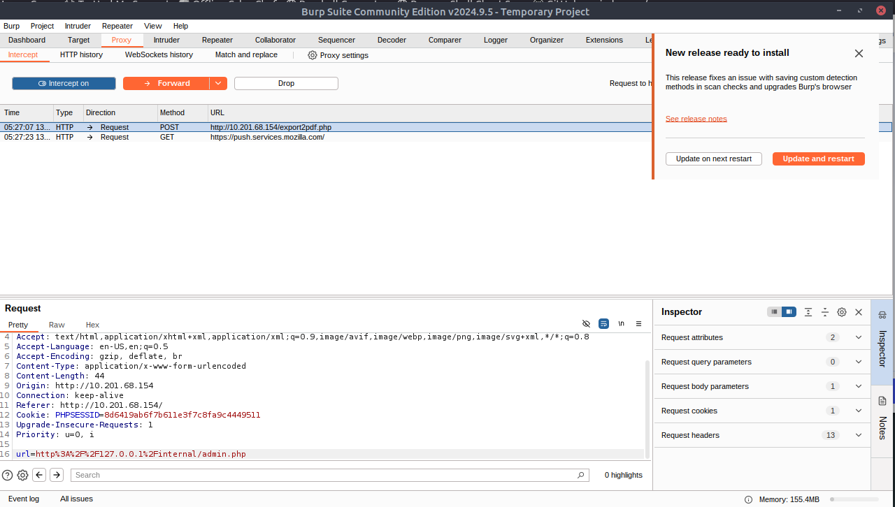
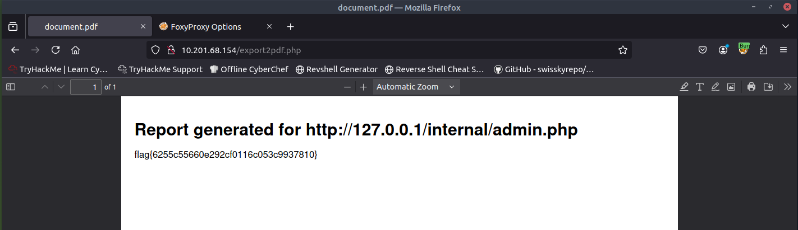

{width="5.905555555555556in"
height="2.3361111111111112in"}

Relatório de CTF

Surfer -- TryHackMe

+:-----------------------------------:+:-----------------------------------:+
| **Informações do documento**                                              |
+-------------------------------------+-------------------------------------+
| **Referência**                      | Surfer -- Mitchell Santana Miyake   |
+-------------------------------------+-------------------------------------+
| **N° Revisão**                      | 1                                   |
+-------------------------------------+-------------------------------------+
| **Data de publicação**              | 13/11/2025                          |
+-------------------------------------+-------------------------------------+
| **Link**                            | <https://tryhackme.com/room/surfer> |
+-------------------------------------+-------------------------------------+

  ----------------------- ----------------------- -----------------------
  **Redação**             Nome do realizador      Mitchell Santana Miyake

  **Revisão**             Nome do revisor         Orientador

  **Aprovação**           Nome do aprovador       Diretor
  ----------------------- ----------------------- -----------------------

+:-----------------------:+:-----------------------:+:---------------------------------------------:+
| **Histórico de revisões**                                                                         |
+-------------------------+-------------------------+-----------------------------------------------+
| **N°**                  | **Entregas**            | **Descrição**                                 |
+-------------------------+-------------------------+-----------------------------------------------+
| **0**                   | DD/MM/AAAA              | Produção                                      |
+-------------------------+-------------------------+-----------------------------------------------+
| **1**                   | DD/MM/AAAA              | Revisão                                       |
+-------------------------+-------------------------+-----------------------------------------------+
| **2**                   | DD/MM/AAAA              | Aprovação                                     |
+-------------------------+-------------------------+-----------------------------------------------+

**Sumário**

[Contextualização [2](#_heading=h.gjdgxs)](#_heading=h.gjdgxs)

[Desenvolvimento [3](#_heading=h.1fob9te)](#_heading=h.1fob9te)

[Uncover the flag on the hidden application page.
[3](#_Toc2100876631)](#_Toc2100876631)

[Conclusão [7](#_heading=h.1t3h5sf)](#_heading=h.1t3h5sf)

[Referências [7](#_heading=h.4d34og8)](#_heading=h.4d34og8)

[]{#_heading=h.gjdgxs .anchor}

Contextualização

O CTF Surfer da TryHackMe é um desafio de nível fácil a intermediário
focado na exploração de falhas em aplicações web. O principal objetivo é
encontrar uma maneira de comprometer a máquina através de
vulnerabilidades de injeção de comando, que são introduzidas ao tentar
\"surfar\" a rede e interagir com um backend que manipula a entrada do
usuário de forma insegura. A sala exige que o jogador enumere
cuidadosamente os parâmetros da URL e os campos de entrada, aplicando
técnicas para testar e explorar essas vulnerabilidades em um ambiente
Linux.

[]{#_heading=h.1fob9te .anchor}Desenvolvimento

[]{#_Toc2100876631 .anchor}Uncover the flag on the hidden application
page.

Primeiramente utilizamos o nmap para escanear e obter as portas abertas

{width="5.90625in" height="3.9270833333333335in"}

Podemos observar que a porta 80 está aberta, logo podemos utilizar o
navegador para acessar o endereço da máquina.

{width="5.90625in" height="2.8541666666666665in"}

A saída do nmap também citou a existência do robots.txt, logo podemos
tentar acessá-lo.

{width="5.90625in" height="1.96875in"}

Dentro do robots.txt o subdomínio /backup/chat.txt é citado, vamos
acessá-lo.

{width="5.90625in" height="2.5833333333333335in"}

Obtemos um registro de conversa, em que um dos usuários reclama sobre o
usuário admin utilizar seu nome como credenciais, podemos então utilizar
admin:admin para logar no sistema.

{width="5.90625in" height="2.71875in"}

No campo "Recent Activity" o subdomínio /internal/admin.php é
mencionado, vamos tentar acessá-lo.

{width="5.90625in" height="1.125in"}

O site também possui um botão que retorna o seguinte relatório.

{width="5.90625in" height="3.8125in"}

Podemos utilizar o **burp** no foxyproxy com o **BurpSuite** para
realizar o proxy da requisição deste relatório.

{width="5.90625in" height="3.3645833333333335in"}

O campo url pode ser modificado da seguinte maneira para obtermos acesso
ao subdomínio secreto.

{width="5.90625in" height="3.3541666666666665in"}

Dessa maneira obtemos acesso ao subdomínio secreto e obtemos a flag

{width="5.90625in" height="1.7083333333333333in"}

[]{#_heading=h.1t3h5sf .anchor}Conclusão

O aprendizado principal na realização do CTF Surfer foi a navegação de
plataformas web com foco em interceptar, inspecionar e manipular
requisições HTTP, permitindo a identificação e a exploração manual de
vulnerabilidades.

[]{#_heading=h.4d34og8 .anchor}Referências

- [Write
  Up](https://medium.com/@josephalan17201972/surfer-tryhackme-write-up-1c54b7ea9e22)
