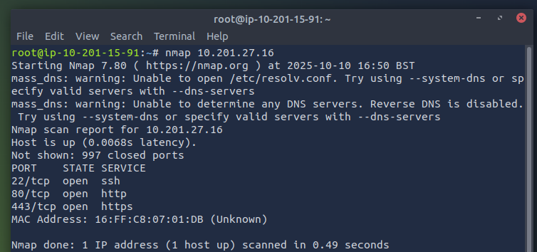
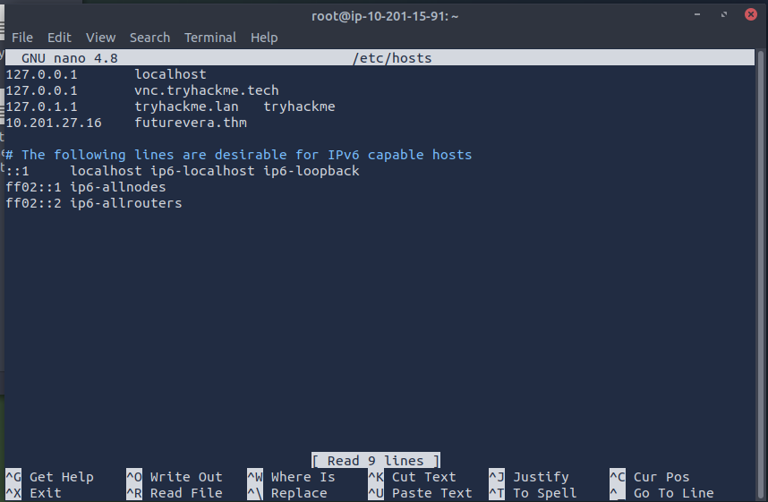
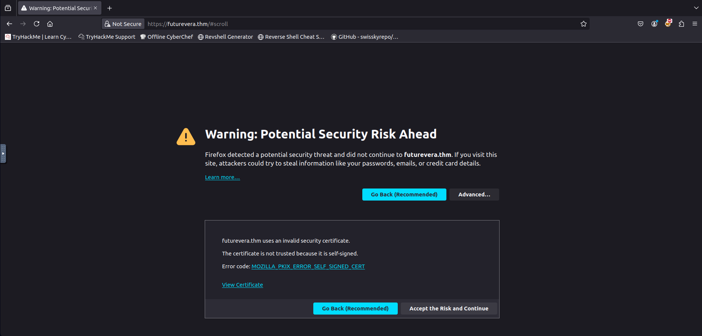
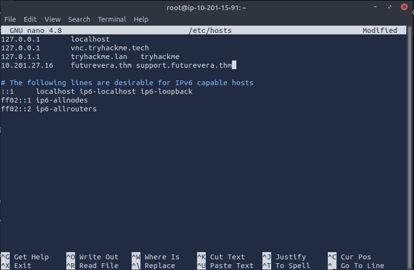
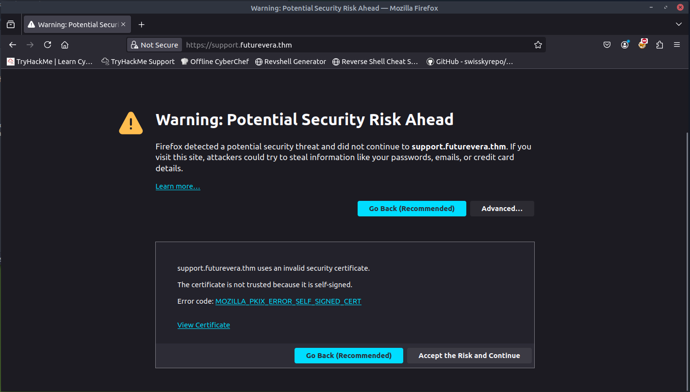
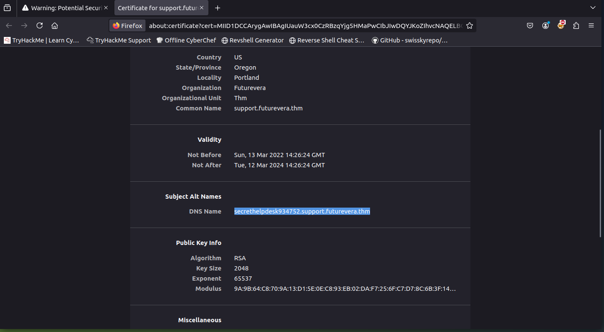
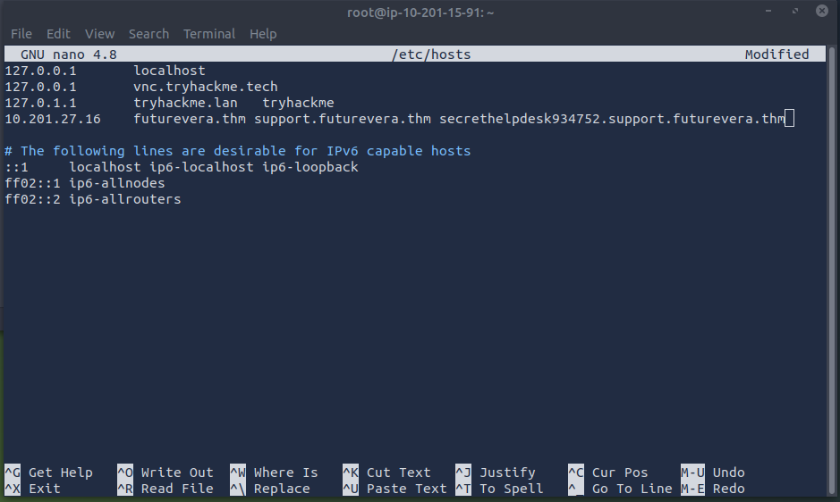
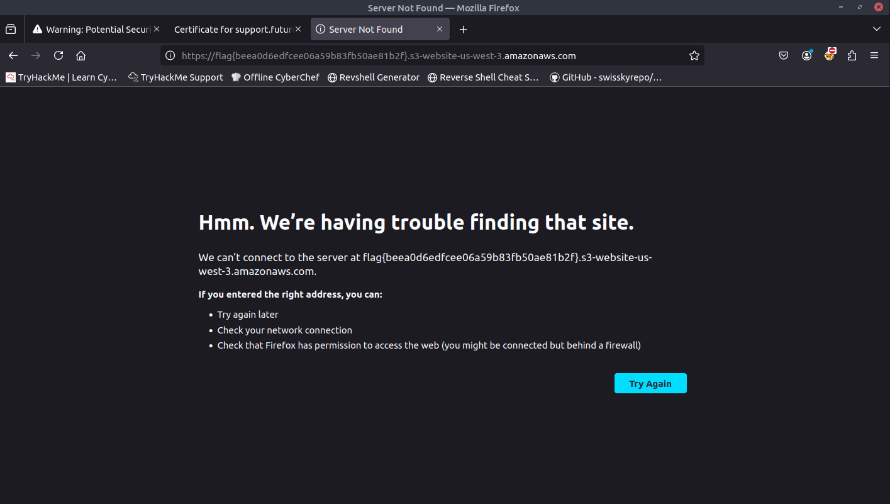

{width="5.905555555555556in"
height="2.3361111111111112in"}

Relatório de CTF

Take Over -- TryHackMe

+:-----------------------------------:+:-----------------------------------:+
| **Informações do documento**                                              |
+-------------------------------------+-------------------------------------+
| **Referência**                      | Take Over-- Mitchell Santana Miyake |
+-------------------------------------+-------------------------------------+
| **N° Revisão**                      | 1                                   |
+-------------------------------------+-------------------------------------+
| **Data de publicação**              | 10/10/2025                          |
+-------------------------------------+-------------------------------------+
| **Link**                            | https://tryhackme.com/room/takeover |
+-------------------------------------+-------------------------------------+

  ----------------------- ----------------------- -----------------------
  **Redação**             Mitchell Santana Miyake Estudante

  **Revisão**             Nome do revisor         Orientador

  **Aprovação**           Nome do aprovador       Diretor
  ----------------------- ----------------------- -----------------------

+:-----------------------:+:-----------------------:+:---------------------------------------------:+
| **Histórico de revisões**                                                                         |
+-------------------------+-------------------------+-----------------------------------------------+
| **N°**                  | **Entregas**            | **Descrição**                                 |
+-------------------------+-------------------------+-----------------------------------------------+
| **0**                   | 10/10/2025              | Produção                                      |
+-------------------------+-------------------------+-----------------------------------------------+
| **1**                   | DD/MM/AAAA              | Revisão                                       |
+-------------------------+-------------------------+-----------------------------------------------+
| **2**                   | DD/MM/AAAA              | Aprovação                                     |
+-------------------------+-------------------------+-----------------------------------------------+

**Sumário**

[Contextualização [2](#_Toc1361048200)](#_Toc1361048200)

[Desenvolvimento [2](#_Toc1696766094)](#_Toc1696766094)

[What\'s the value of the flag? [3](#_Toc84664928)](#_Toc84664928)

[Conclusão [6](#_Toc164562721)](#_Toc164562721)

[Referências [7](#_Toc2108426255)](#_Toc2108426255)

[]{#_Toc1361048200 .anchor}Contextualização

O CTF TakeOver envolve numeração de subdomínios e simula uma situação de
sequestro de subdomínio.

[]{#_Toc1696766094 .anchor}Desenvolvimento

[]{#_Toc84664928 .anchor}What\'s the value of the flag?

Iniciamos com o **nmap** para obter as portas abertas, com isso
percebemos que a porta 80 está aberta.

{width="5.677083333333333in"
height="2.6633234908136485in"}

Seguindo a sugestão do CTF, adicionamos o endereço da máquina e seu
domínio ao /etc/hosts utilizando o **nano** para editá-lo.

{width="5.802083333333333in"
height="3.796424978127734in"}

Logo o url se torna acessível e exibe a seguinte página.

{width="5.90625in" height="2.8333333333333335in"}

As instruções do CTF também citam que o domínio possui um subdomínio de
suporte, logo devemos adicioná-lo ao /etc/hosts.

{width="5.90625in" height="3.8541666666666665in"}

Ao acessá-lo a seguinte página é exibida:

{width="5.90625in" height="3.3541666666666665in"}

Em seguida clicamos em "View Certificate", e analisamos o certificado da
url, onde encontramos outro subdomínio.

{width="5.90625in" height="3.25in"}

Novamente devemos adicionar este domínio ao /etc/hosts, utilizando o
**nano**.

{width="5.90625in" height="3.53125in"}

Por fim, ao acessar este último domínio, somos recebidos com a url de um
bucket s3 da AWS que contém a flag.

{width="5.90625in" height="3.34375in"}

[]{#_Toc164562721 .anchor}Conclusão

O CTF simula uma situação real de sequestro de domínio e me proporcionou
um aprendizado relevante sobre interpretar o contexto do cliente e
contribuiu para o meu entendimento de estruturas web. Logo, se trata de
um ótimo CTF para introduzir e explicar sequestro de domínio.

[]{#_Toc2108426255 .anchor}Referências

- https://github.com/Cyberretta/Write-Ups-THM/blob/main/TakeOver.md
